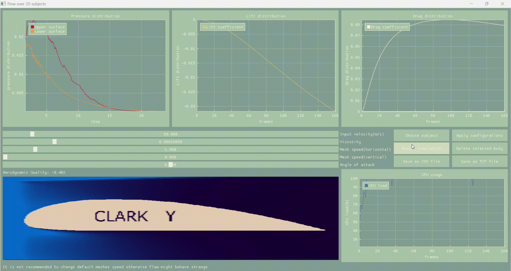

# CFD-2D-solver

## Introduction:
I started doing this project because I read a book "Fundamentals of Aerodynamics" which is written by Anderson and this book a lot of times 
mentioned CFD(computational fluid dynamics) so that is why I did it - just to combine physics with coding which are both very
interesting fields for me.

## 📷Preview:


## 🛠️ Used tools(crucial libraries):
* **tkinter** - Adjusts user window scale. 
* **numba** - Used for JIT compilation to accelerate mathematical loops.
* **numpy** - Handled heavy multi-dimensional array operations.
* **DearPyGui** - Represents the main Graphical User Interface (GUI).
* **opencv(cv2)** - Utilized for image processing and matrix transformations.
* **pandas** - Managed and structured simulation history data. 
* **psutil** - Monitored hardware (CPU data and disk storage availability).
* **faker** - Generated randomized filenames for saving configurations.
* **time** - Simply to calculate time.

## ⚡ Features:
* fully-fledged 2D flow solver for airfoils or other 2D subjects based on physical formulas
* displayed graphics of important coefficients such as pressure , lift , drag coefficients
* aerodynamic quality of airfoil becomes almost similar to the real(empirical) quality after approximately 7000 fps
* user can pause a simulation at any moment or delete and upload another image of airfoil
* user also can save complete history of data as CSV file
* user can change some configurations such as angle of attack or input velocity by using sliders
 
## 🧠 Highlighted key concepts:
* numba compilators were used in order to obtain swift calculations
* finite numerical methods were applied for solving partial differential equations
* cv2 was used for getting a desirable body from uploaded photo
* method cv2.warpAffine helped to rotate massive by converting orthogonal coordinates into polar coordinates
* library psutil was applied in order to get CPU data and check memory on user disk

# 🔄 The sequence of the process:
As user uploads 2D picture(say airfoil) code automatically starts creating a mask for image and after that computational part starts where 
advection and diffusion are being calculated. After code has u_new and v_new and calculates divergence(simply time rate of change of volume).
Then it calculates Poisson Equation to obtain new pressure field - and this is needed to calculate Euler Equation which allows to change velocity
components and direct them to the places where there is lack of pressure(that procedure makes our flow avoid some obstacles and behave naturally).
Eventually we see beatiful interface with displayed flow where magnitude of speed is shown by rgba differences.

## 📷Second preview:
   

## 🔧 Running the project:

### Prerequisites
Make sure you have Python Installed. Then, install the required libraries:
```bash
pip install numba numpy psutil opencv dearpygui pandas faker
```
###Execution
1) Clone this repository or download the `CFD_project_solver_2D.py` file.
2) Run the script using your IDE (PyCharm / Visual Studio Code) or directly via terminal:
```bash
python CFD_project_solver_2D.py
```

## 🎯 Conclusion:
Honestly say it was very complicated to create such a project because it relies on partial differential equations which 
I started studying just recently. Nevertheless I don't regret that I started doing this project cause I found out lot's of the new methods for working 
with arrays and learned how to use a numba compilator normally. There might be still some bugs in the code but it accomplishes its planned function. 
In the end I would like to say that CFD is REALLY difficult to understand and write but if your try to do you best - you will write succesfully!


